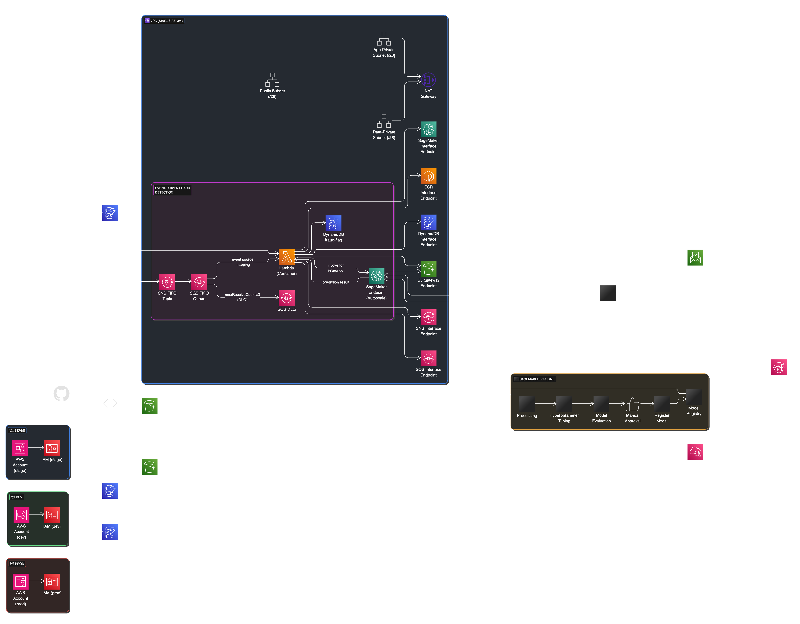

# Fraud Detection MLOps MVP on AWS


An end-to-end project demonstrating AWS capabilities using an event-driven architecture for fraud detection, aligned with MLOps best practices.

## Overview

This project implements a production-style, event-driven MVP for real-time credit card fraud detection. The system showcases end-to-end MLOps skills on AWS, using a publicly available credit card dataset.

### Key Features

- Event-driven architecture using SNS/SQS for message processing
- Real-time fraud detection with SageMaker endpoints
- MLOps pipeline for model training, evaluation, and deployment
- Infrastructure as Code (IaC) with Terraform
- CI/CD with GitHub Actions
- Multi-environment setup (dev, stage, prod)
- Comprehensive monitoring and alerting

## Architecture



## Getting Started

### Prerequisites

- AWS CLI configured with appropriate credentials
- Terraform (version >= 1.0.0)
- Python 3.11+
- Docker (for local testing and building Lambda containers)

### Installation

1. Clone this repository
2. Install dependencies:
   ```bash
   python -m pip install uv
   uv venv
   uv pip install -e ".[dev]"
   ```
3. Configure AWS credentials for each environment
4. Initialize Terraform:
   ```bash
   terraform init
   ```

## Development

### Running Tests

```bash
pytest
```

### Deploying Infrastructure

```bash
# For dev environment
terraform workspace select dev
terraform apply

# For stage environment
terraform workspace select stage
terraform apply

# For production environment
terraform workspace select prod
terraform apply
```

## Project Structure

- `docs/` - Documentation and architecture diagrams
- `fraud_detection/` - Python package containing business logic
- `infrastructure/` - Terraform configuration files
- `lambda/` - Lambda function code and Dockerfile
- `notebooks/` - Jupyter notebooks for exploratory data analysis
- `tests/` - Unit and integration tests

## License

This project is licensed under the terms of the license included in the repository.
